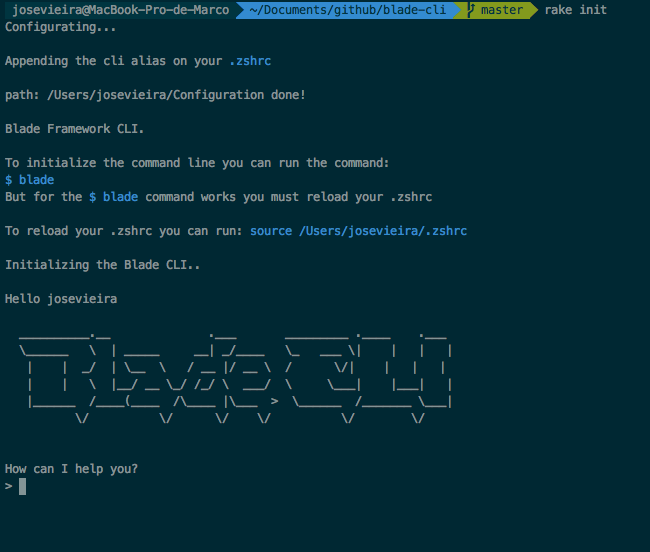

# blade-cli
Command line to make it easier config, executation and scaffolds to framework [Blade](https://github.com/biezhi/blade).

# Overview

  

Repository designed to build a cli for the blade framework

# commands to implement

### New
Create a maven project with the dependecy blade and hello world endpoint.

### Run
Execute project

### Scaffold
Generate crud Rest

### Migrations
To generate sql files
