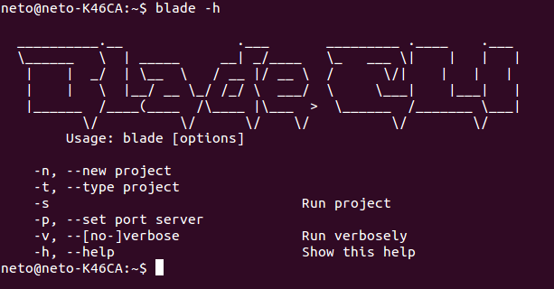

# Blade CLI
Command line to make it easier config, executation and scaffolds to framework [Blade](https://github.com/biezhi/blade).

# Overview
<p align="center">
  
</p>

# Alert
In development. Help us! Make a fork

# Requeriments
* ruby
* maven
* java

# Installation

To get started follow those steps:

1- Clone the project:

```bash
git clone https://github.com/NetoDevel/blade-cli.git
```

2- Install the dependency if you do not have already installed:

```bash
$ gem install bundler
$ bundle install
```

3- Inside the folder project run:

```bash
$ rake init
```

# Usage 

Commands that we can already test

Create a new project
```bash
blade -n my-project com.example.myproject
```

Inside the folder project run:

```bash
blade -s
```

```bash
blade -g controller Hello
```

other commands in development...


## Acknowledgment
         
 * [Rachid](https://github.com/rachidcalazans)
 * [Thiago](https://github.com/kidush)


